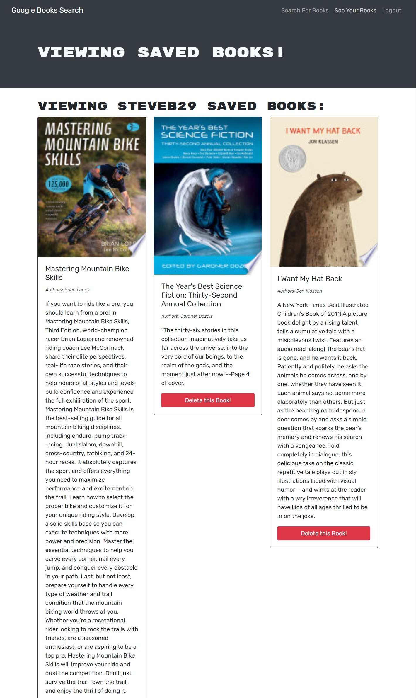

# MERN stack book search
- On page load, user is greeted with a navbar with options and a book search.
- Users can search books anonymously without logging in.
- Users can sign up or log in and their session is validated using JWT.
- When logged in, users can save books to their personal list.
- From their list, users can remove books from their list.
- App was refactored to use Apollo and GraphQL for it's routing and database manipulations.

## Deployed application and repository
- [Repository](https://github.com/SteveB29/mern-book-search)
- [Deployed application](https://hidden-ridge-76501.herokuapp.com/)

## Screenshot
